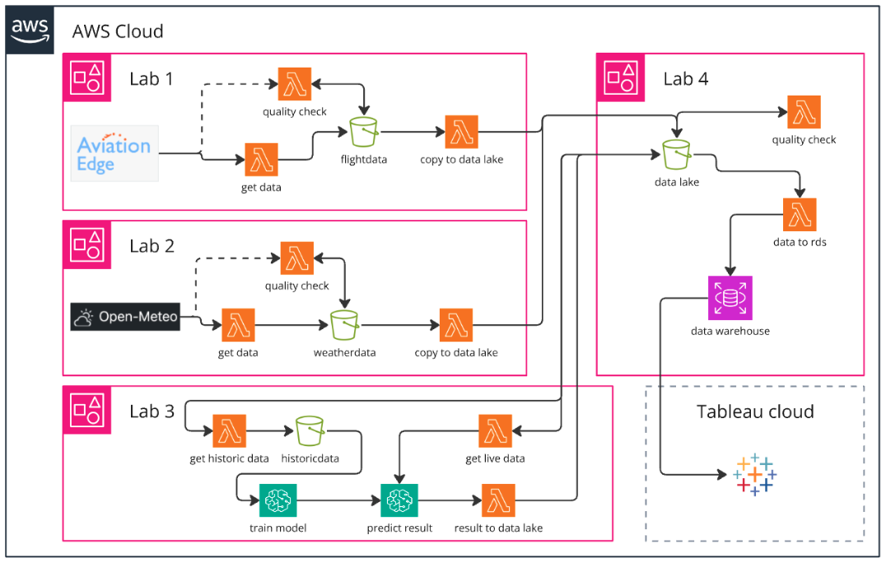

# WEATHER BASED DELAY PREDICTION IN AVIATION​

In this project, we set up a data warehouse and data lake system using AWS in the scope of the HSLU M.Sc. in Applied Information and Data Science course. 
The scope is about extracting historical weather and aviation data, training a model which predicts cancellations based on extreme weather events and using this model 
to predict future cancellations and delays based on airport locations.

## Dashboards
### For each Airport
1. [AMS Amsterdam](https://oliverheisel.grafana.net/public-dashboards/54b39863f0eb4728bfd2971c83a85efb)
2. [CDG Paris](https://oliverheisel.grafana.net/public-dashboards/3e02d6593eb842d7b25438a810b91791)
3. [FRA Frankfurt](https://oliverheisel.grafana.net/public-dashboards/22d72ad0730147e9a34cb91847123919)
4. [LHR London](https://oliverheisel.grafana.net/public-dashboards/026355ddb94649589cef73c6a34f1c07)
5. [ZRH Zürich](https://oliverheisel.grafana.net/public-dashboards/6014e6bbbce04360831691730bf5ee5f)
6. [Overview](https://oliverheisel.grafana.net/public-dashboards/c5d09ed6185b4d3584a3851420b0d31e) (only works internally because of the template variable)

### Statistics
- [Flight Stats](https://oliverheisel.grafana.net/public-dashboards/6014e6bbbce04360831691730bf5ee5f)

## Architecture
The scripts for each lab can be found in their respective folders. The representation deviates from the actual Lambda function and script, as adjustments were necessary due to the limitations of the labs.

